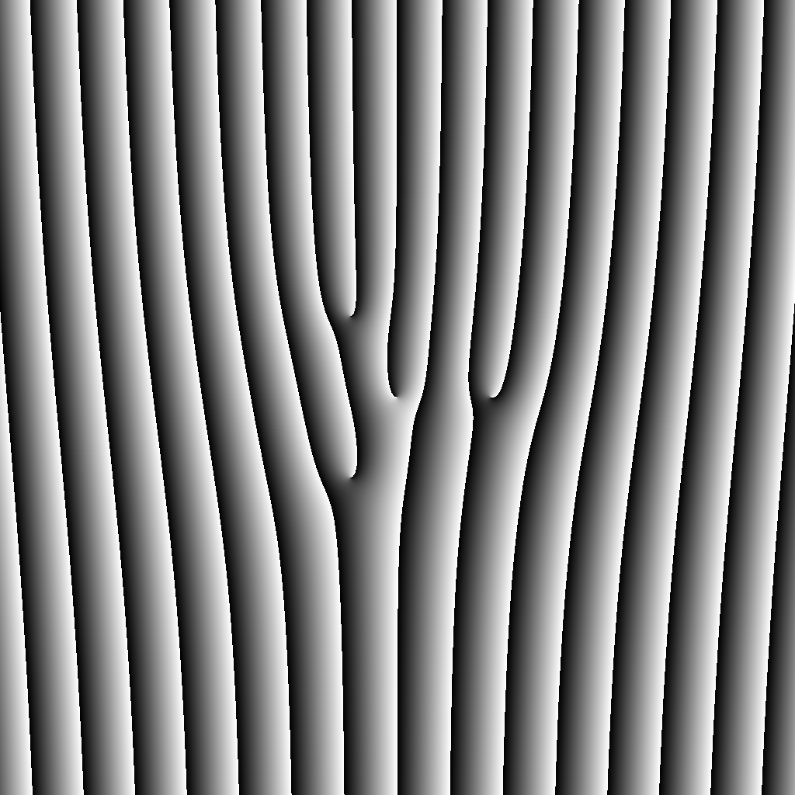

# Computer-Generated Holography for OAM Superposition

A MATLAB implementation for generating **Orbital Angular Momentum (OAM)** carrying beams and their superposition states (Petal Patterns) using **Computer-Generated Holography (CGH)**.

This project is an optimized, vectorized refactoring of the original code developed at Colgate University. It is designed to generate phase patterns for **Spatial Light Modulators (SLM)**.




## 📜 Credits and Attribution

The core physical algorithms and logic are based on the work of:
* **Brett Rojec** and **Prof. Kiko Galvez**


**Modifications by pj sun (BIT):**
* **Vectorization:** Refactored nested loops into MATLAB matrix operations (`meshgrid`, `cart2pol`) for high-speed generation.
* **Refactoring:** Simplified the variable naming and logical flow to strictly align with the complex amplitude superposition principle.
* **Optimization:** Improved computational efficiency for high-resolution (1024x1024) SLM patterns.

## 🧠 Theoretical Background

### 1. Orbital Angular Momentum (OAM)
Light beams with a helical phase front carry OAM. The complex amplitude of a Laguerre-Gaussian (LG) mode is proportional to:

$$E_{\ell}(r, \phi) \propto A(r) \exp(i \ell \phi)$$

Where $\ell$ is the topological charge (an integer), and the beam carries an OAM of $\ell \hbar$ per photon.

### 2. Superposition States (Petal Patterns)
When two OAM modes with different topological charges ($\ell_1$ and $\ell_2$) are superimposed, they interfere to form a spatially structured intensity profile (often called a "Petal Pattern"):

$$E_{total} = E_{\ell_1} + E_{\ell_2} = A_1(r) e^{i \ell_1 \phi} + A_2(r) e^{i \ell_2 \phi}$$

The number of interference petals is determined by:
$$N_{petals} = |\ell_1 - \ell_2|$$

### 3. Hologram Generation
To modulate this field using a phase-only SLM, we interfere the target field $E_{total}$ with a tilted plane wave (reference beam) to create a "Forked Grating":

$$\Phi_{SLM}(x,y) = \text{angle}(E_{total}) + k_x x$$

## 🚀 Features

* **High Performance:** Generates 1024x1024 holograms in milliseconds using vectorized MATLAB code.
* **Flexible Configuration:** Easily adjust topological charges (`ell1`, `ell2`) to create various fork gratings or petal patterns.
* **Amplitude Modulation Correction:** Includes logic to simulate amplitude modulation on phase-only devices (optional).
* **Blazing Correction:** Supports phase blazing for higher diffraction efficiency.

## 🛠 Usage

1.  **Clone the repository:**
    ```bash
    git clone [https://github.com/YourUsername/OAM-Hologram-Generation.git](https://github.com/YourUsername/OAM-Hologram-Generation.git)
    ```
2.  **Open MATLAB** and navigate to the `src` folder.
3.  **Run the script:**
    Open `generate_oam_superposition.m` and run it.
4.  **Parameters:**
    Modify the following variables to change the output:
    ```matlab
    ell1 = 1;   % Topological charge 1
    ell2 = 4;   % Topological charge 2 (Superposition)
    s = 0.1;    % Grating period density
    ```
5.  **Output:**
    The generated hologram (BMP format) will be saved in the root directory.

## 📝 License

**Academic Use Only.**
This code is based on work copyright by Colgate University ("Not for commercial use").
Modifications are provided for educational and research purposes.